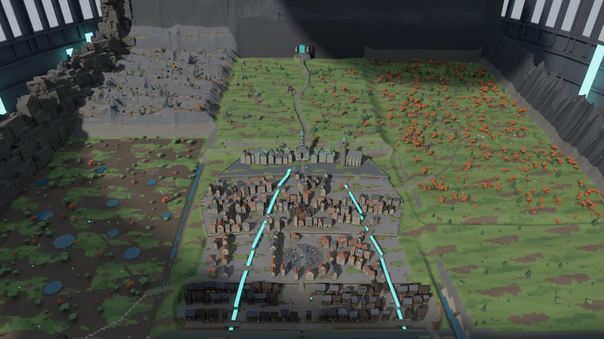

# The Spire

A third-person action RPG for Roblox set inside an endless tower above a
drowned world. This repository is a [Rojo](https://rojo.space) project
(Rojo 7.6+, see `rokit.toml`). Every script is strict Luau.

> **Status:** Phase 9 (World) — the building kit, the edit-time world
> generators, Floor 1 *Lowharbor*, the Sunken Cistern dungeon, lighting and
> day/night, ambient life, streaming, and the runtime world systems
> (waystones, zones, healing pools, treasure, dungeon instancing). The repo
> also carries the foundation Phase 9 depends on: Config, Strings, Types,
> Util, Net, DataService, UITheme/Components and the two bootstraps.



## Layout

```
default.project.json         Rojo project (syncRules put DESIGN_DECISIONS.md into ServerStorage)
src/
  ReplicatedStorage/Shared/
    Config/                  World, Lighting, Net, Data tuning; generated Palette
    Strings/                 every player-facing string
    Types.lua                shared Luau types (kit, plan, floor schema)
    Util/                    Maid, Signal, Rng (deterministic), Geom, WorldFX
    Net/                     single remote definition, rate limits, argument checks
    UI/                      Theme (UITheme) and Components
    Data/                    KitManifest (generated), KitAssemblies, EmitterPresets,
                             AssetManifest, Items, Floors/Lowharbor
  ServerScriptService/
    Server.server.lua        server bootstrap (Init all, then Start all)
    Systems/                 DataService, WorldService, FloorService, DungeonService
  ServerStorage/
    WorldBuilder/            edit-time only: planners + Studio applier
      Plan/                  pure-Luau planners (no Roblox types)
      KitLibrary, PlanApplier, TerrainApplier, init (Build / ImportKit / Clear)
    DESIGN_DECISIONS.md
  StarterPlayer/StarterPlayerScripts/
    Client.client.lua        client bootstrap
    Controllers/             Settings, Lighting, Canal, Ambient, Prompt,
                             WorldFeedback, Zone, Waystone
assets/kit/                  Blender kit: fbx/ per piece, kit.blend, kit_manifest.json
assets/textures/             generated Current water textures
tools/blender/               kit generator and preview renderers (plan and parts)
tools/harness/               runs the planners in the Luau CLI and outputs JSON
tools/lune/                  runs the real WorldBuilder offline and writes a place file
tools/textures/              texture generator
docs/previews/               renders of the generated world
```

## Building Lowharbor in Studio

1. `rojo serve` and connect the Studio plugin (or `rojo build -o TheSpire.rbxl`).
2. **Import the kit.** Use Studio's 3D Importer to bulk-import
   `assets/kit/fbx/*.fbx` into `ReplicatedStorage/Assets/Kit`, with file
   dimensions in studs. Then run in the command bar:
   ```lua
   require(game.ServerStorage.WorldBuilder).ImportKit()
   ```
   This names, sizes and configures every MeshPart from the KitManifest and
   warns if an import changed a piece's proportions. You can skip this step:
   the builder falls back to blockout parts generated from the manifest, so
   the floor is walkable before the art import.
3. **Build the floor:**
   ```lua
   require(game.ServerStorage.WorldBuilder).Build("Lowharbor")
   ```
   This writes terrain (about 750×750 voxel columns), the static world into
   `Workspace/Floors/Lowharbor`, the dungeon template into
   `ServerStorage/DungeonTemplates/SunkenCistern`, and a report into
   `ServerStorage/BuildReports/Lowharbor`. Save the place afterwards. The
   generators never run at runtime.
4. Optionally, upload `assets/textures/*.png` and paste the ids into
   `Shared/Data/AssetManifest.lua` to get scrolling flow on the canals.

Rebuild just the world (keeping the terrain): `Build("Lowharbor", { terrain = false })`.

## Offline verification (no Studio needed)

```bash
# Kit: generate meshes, manifest and palette (Blender 4.x or the bpy wheel)
python tools/blender/build_kit.py --repo .

# Plan the floor in the Luau CLI and print stats / instance budget
python tools/harness/run_luau.py tools/harness/entries/floor.luau Lowharbor plan > floor.json
python tools/harness/run_luau.py tools/harness/entries/floor.luau Lowharbor terrain 8 > terrain.json

# Render the plan with the real kit meshes
python tools/blender/preview_plan.py --plan floor.json --terrain terrain.json \
    --out shots --shots "town:-330,160,1300:20,30,760:32"

# Run the real Studio build path (PlanApplier/KitLibrary) under Lune and
# write a place file (no terrain), plus a parts dump for preview_parts.py
rojo build default.project.json -o build/TheSpire.rbxl
lune run tools/lune/build_world.luau build/TheSpire.rbxl build/Lowharbor_world.rbxl Lowharbor

# Strict type-check everything
rojo sourcemap default.project.json -o sourcemap.json
luau-lsp analyze --platform roblox --sourcemap sourcemap.json \
    --definitions @roblox=globalTypes.d.luau $(find src -name "*.lua")
```

See `docs/PHASE9.md` for the phase report.
