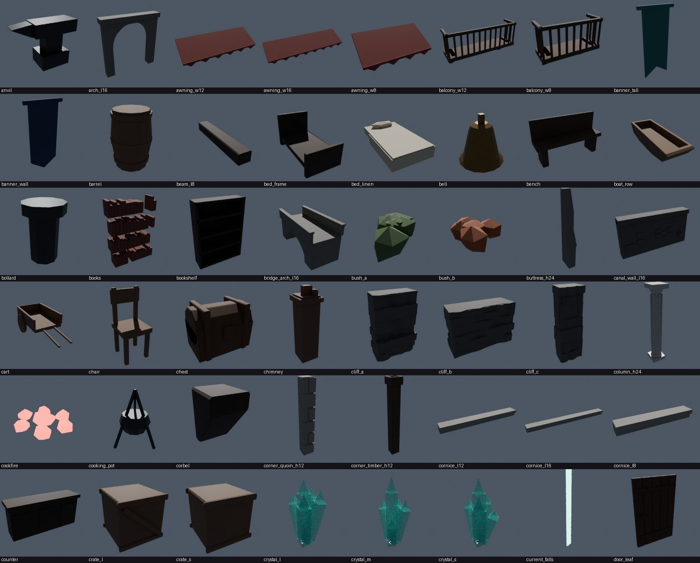
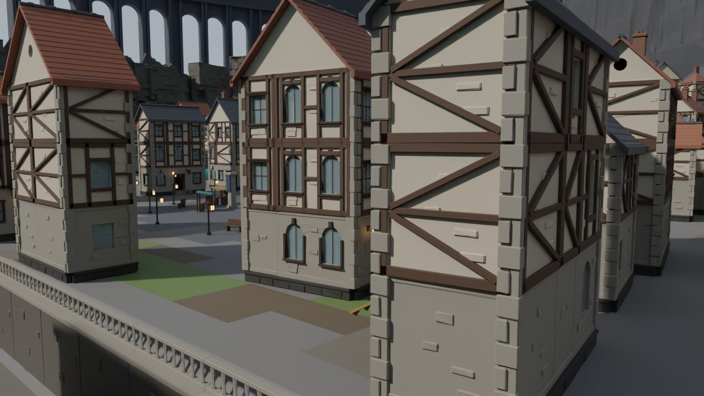
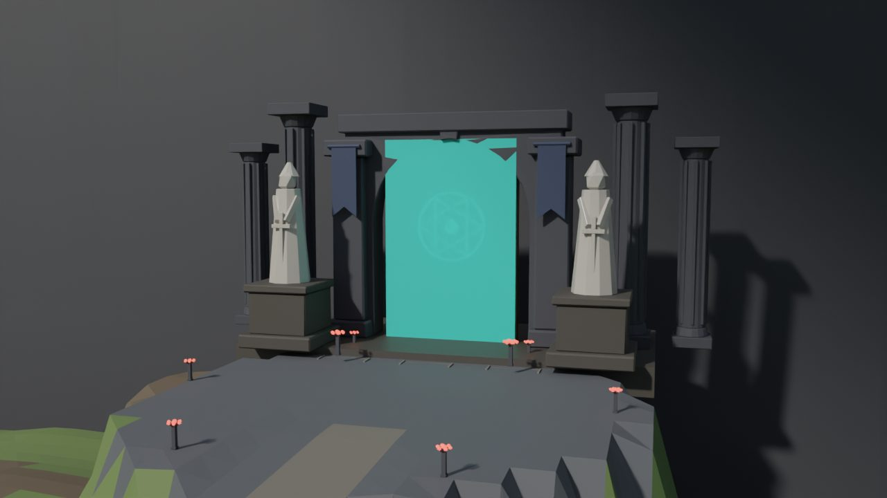

# Phase 9 — World: report

## What was built

**Building kit (Blender).** `tools/blender/build_kit.py` generates 253
bevelled, single-material pieces on a 4-stud grid, in all ten kit categories:

- foundations and plinths in 3 heights;
- 7 wall types × 3 widths, plus half-timber overlays;
- corners, pillars, columns and buttresses;
- beams and corbels;
- roofs: slopes for 6 pitch runs, gable ends with or without attic windows,
  ridges, hip caps, cones, domes, chimneys and dormers;
- stairs: switchback, straight, spiral, and exterior stone steps;
- balconies, railings, awnings, banners and signs;
- trims: cornices, glowing rune bands, window and door frames, glass panes,
  door leaves;
- props, harbour and canal pieces, landmark pieces, nature, ambient-life
  meshes, and dungeon fixtures.

Stone pieces get edge chipping and proud ashlar stones. UVs are world-scale
for constant texel density. Each piece is exported as its own FBX, and the
generator emits `Shared/Data/KitManifest.lua` (sizes, centres, collision
modes, collider boxes and wedges, wall openings, anchors, triangle counts)
and `Shared/Config/Palette.lua`.

**BuildingGenerator** (`Plan/BuildingPlanner`). Takes a footprint, storey
count, style, wealth, kind, seed, plinth height and scale, and produces:

- a plinth;
- symmetric facades with a door at the centre;
- per-kind ground floors (shopfronts with awnings, archdoor warehouses);
- arched or rectangular windows with frames and night-glow glass;
- half-timbering on plaster storeys and balconies on upper doors;
- quoined or timber corners, cornices and rune bands;
- floor slabs with beams;
- stairs connecting every storey, with a hole and balustrade above each;
- gable or hip roofs matched to the footprint, with dormers, chimneys and
  smoke;
- entrance steps, a door lantern, and a hanging sign on trade buildings;
- furnished interiors (`Plan/InteriorPlanner`) for house, shop, tavern,
  smithy, library, barracks, warehouse and hall. Every ground floor is
  furnished, with the door corridor and stair kept clear.

**DistrictGenerator** (`Plan/DistrictPlanner`). Builds curved, noise-warped
lanes and cross lanes that are never a perfect grid. Lots are placed along
every street frontage and face it. Height and style vary by district (Docks,
Market, Residential, Noble). Streets get lamps and clutter, and lane ends at
terrace drops get overlook balustrades.

**Floor 1: Lowharbor** (`Data/Floors/Lowharbor`). The full layout:

- **Town:** 5 terraced districts (Docks 6 → Market 22 → Lower Terraces 38 →
  Upper Terraces 54 → Guild Hill 72) with 248 generated buildings. The main
  quest path (pier → Harbor Steps → Grand Stair → Lantern Plaza → Terrace
  stairs → Climbers' Ascent → Climbers' Guild) is handcrafted as streets.
- **Canals:** 2 Current canals with waterfalls between terraces and
  automatic bridges.
- **Plazas:** 5 plazas with market stalls, a well, a statue, lantern rings
  and the healing Current spring.
- **Landmarks:** the Climbers' Guild (2× scale, 7-ring beacon tower),
  Tidewatch Cathedral (2× nave, bell tower, rose window, colonnade, pews), the
  lighthouse with the Lantern Room, the moored trader ship, the main and
  fishing piers, the Sunken Cistern pumphouse, and the sealed Guardian Gate
  (5× pylons, 3× arch, colossal statues, rune seal, braziers).
- **Wild zones:** Tidepool Marsh (12 tidepools, willows, reeds, the ruined
  Reed Watchtower, the Wreckers' Strand), Rustwood Forest with the hunters'
  camp, Gatewatch Rise with its ruins, and Gatewatch Crags.
- **Hidden areas (4):** Smugglers' Grotto, Drowned Bell Chapel, Hermit's
  Hollow and the Lantern Room, each with a per-player treasure chest.
- **Navigation:** 6 Waystones, and 14 zones with Pressure levels.
- **Gameplay markers:** spawn regions for the Floor 1 bestiary, routes for
  the townsfolk, gull circles and fish schools.
- **Skybox:** a ring of 72 colossal tower-wall bays, Current falls, the
  underside of Floor 2 overhead, and the drowned world below.

**The Sunken Cistern** (`Plan/DungeonPlanner`) has 6 rooms, an entry stair
and connecting corridors: Sluice Gallery, Flooded Hall, Leech Pools, Lantern
Chapel, Valve Chamber and Reservoir. It includes Current pools and falls,
three valves that raise the sluice gate, spawn markers, the Cistern Matron
boss marker, a reward chest and exits. `DungeonService` instances it per party.

**Terrain** (`Plan/TerrainPlanner` → `TerrainApplier`). A blended region
heightfield, flattened terrace pads, street/stair/causeway corridors,
carved canals, tidepools, rim cliffs, islet and grotto carves. Materials
follow region, slope, shore and street. Applied through chunked WriteVoxels,
with water, material colours and grass decoration configured.

**Lighting.** `Config/Lighting` holds the Lowharbor time-of-day keyframes
(Future lighting, Atmosphere, ColorCorrection, Bloom, SunRays) plus Cistern
and Cave overrides. The server runs a 24-minute day. The client blends
keyframes and handles the rest:

- lanterns are scaled up at night;
- windows glow;
- fireflies and the beacon glow switch on at night;
- rain falls around the camera;
- canals shimmer brighter at night.

**Ambient life.** Townsfolk walk the main streets. Gulls circle the harbour,
fish school in the bay, and merchants call out in bubble chat. Zone
ambience-loop hooks are in place (the loops themselves aren't authored yet).

**Streaming.** Streaming is enabled with target radius 512 and minimum 160.
Buildings and landmarks are Atomic. Waystones, markers, the Gate, the
pumphouse and the skybox are Persistent. Landmarks use a StreamingMesh LOD.

**Runtime.**

- **Net:** remotes are intent-only, with per-player, per-remote token
  buckets and argument type checks.
- **DataService:** session-locked profiles with the full schema, versioned
  migrations, autosave, BindToClose, and a save block for trades.
- **WorldService:** day/night, zone and Pressure attributes, healing pools.
- **FloorService:** Waystone discovery, fast travel, respawn at the last
  Waystone, per-player chests.
- **DungeonService:** gathering, instancing, valves and gate, clear rewards,
  exits, cleanup.
- **Client UI:** themed prompts (keyboard / gamepad / touch with hold ring),
  zone title cards, the Waystone travel panel (mouse, touch, gamepad) and
  feedback toasts.

## What was tested, and how

This environment has no Roblox Studio, so Play Solo and the 2-player local
server test **were not run**. These checks were run instead:

| Check | Result |
| --- | --- |
| `luau-lsp analyze` (strict, Roblox type definitions, Rojo sourcemap) on all 57 scripts | 0 type errors, 0 lint warnings |
| `rojo build` (Rojo 7.6.1) | builds; DESIGN_DECISIONS.md syncs into ServerStorage |
| Planners in the Luau CLI (`tools/harness`) | full floor plans in ~1.5 s: 248 buildings, 1,147 trees, ~40.7k estimated instances |
| **Real `WorldBuilder.Build` path under Lune** (reflection-checked Instance API) | no errors; `Workspace/Floors/Lowharbor` = **37,185 instances** (budget 40,000); dungeon template 689 |
| Blender renders of the plan with the real kit meshes | overview, top-down, street-level, guild hill, gate, sample buildings (`docs/previews`) |
| Blender render of the Instances PlanApplier produced | pieces, centre offsets, scale, door colliders and stair ramps line up with the plan (`docs/previews/applier_colliders_check.jpg`) |
| Kit contact sheets | every piece reviewed; boolean, ring, baluster and tree issues found and fixed |

Bugs found and fixed while testing:

- Overlapping-shell booleans destroyed door and arch walls.
- Ring pieces vanished.
- The noise hash lost precision in doubles, causing terrain banding.
- The tree budget left the forest bare.
- The first full plan was 74.6k instances; it was cut to 37k by the changes
  listed in DESIGN_DECISIONS §6–7.
- `Attachment.WorldPosition` was replaced by a local position.

## Not yet verified, and remaining work

- **Studio-only behaviour.** Terrain voxel writing, FBX import orientation in
  the 3D Importer, ProximityPrompt flow, teleports and streaming requests,
  lighting look, and phone performance and memory all need a real Studio
  session and a device. The first Studio pass should run `ImportKit`, then
  `Build`, then Play Solo, then a 2-player server, and fix anything the
  Output window reports.
- **Phases 1–8 are not in this repository** (the branch started empty).
  Combat, mobs, the Current, items and progression don't exist yet. Phase 9
  exposes their integration points instead:
  - `MobSpawnRegion` / `DungeonSpawn` / `DungeonBoss` markers;
  - `WorldService.GetPressure`;
  - `DungeonService.ReportBossDefeated` and `SetPartyResolver`;
  - the `InCombat` player attribute checked before fast travel.
- **Art polish still open:**
  - SurfaceAppearance PBR sets for hero assets;
  - original ambience loops (`AssetManifest.Ambience` is empty);
  - MaterialVariants for custom tiling textures;
  - Market blocks have open paved interiors that an infill or courtyard
    pass could fill.
- **Floors 2–5** reuse every generator. Each needs its own `FloorDef`, style
  set and landmark kinds (Phase 14).
